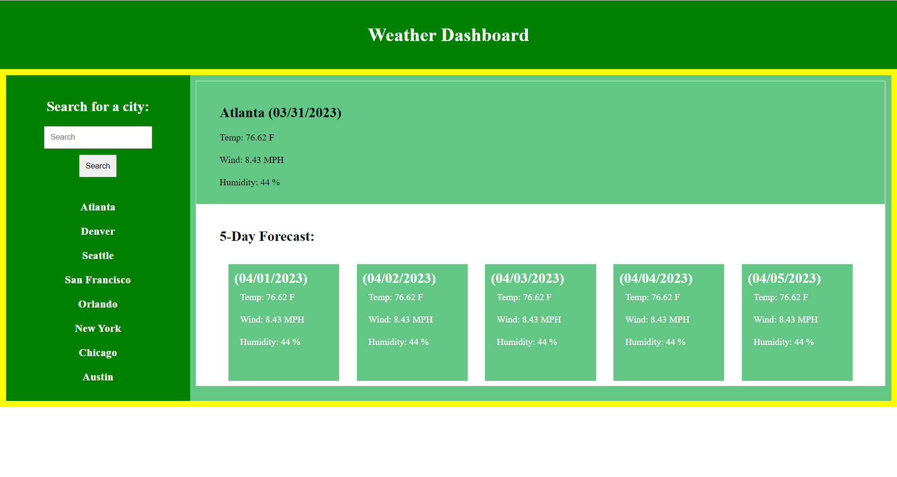

# Weather-Dashboard

## Description
This website help users to:
- View the weather in his/her current location.
- Toggle the temperature unit (Celsius or Fahrenheit).
- See weather icon or background image will change depending on weather conditions.
## User Stoy
```
- AS A traveler
- I WANT to see the weather outlook for multiple cities
- SO THAT I can plan a trip accordingly
```
## Acceptance Criteria
```
- GIVEN a weather dashboard with form inputs
- WHEN I search for a city
- THEN I am presented with current and future conditions for that city and that city is
- added to the search history
- WHEN I view current weather conditions for that city
- THEN I am presented with the city name, the date, an icon representation of weather 
- conditions, the temperature, the humidity, and the the wind speed
- WHEN I view future weather conditions for that city
- THEN I am presented with a 5-day forecast that displays the date, an icon
- representation of weather conditions, the temperature, the wind speed, and the humidity
- WHEN I click on a city in the search history
- THEN I am again presented with current and future conditions for that city
```
## Mock-Up


## Usage
Weather forecasting is an important science. Accurate forecasting can help to save lives and minimise property damage. It's also crucial for agriculture, allowing farmers to track when it's best to plant or helping them protect their crops.
## Installation
N/A